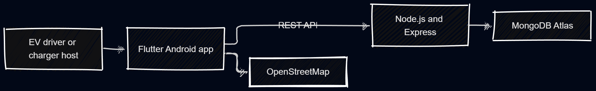
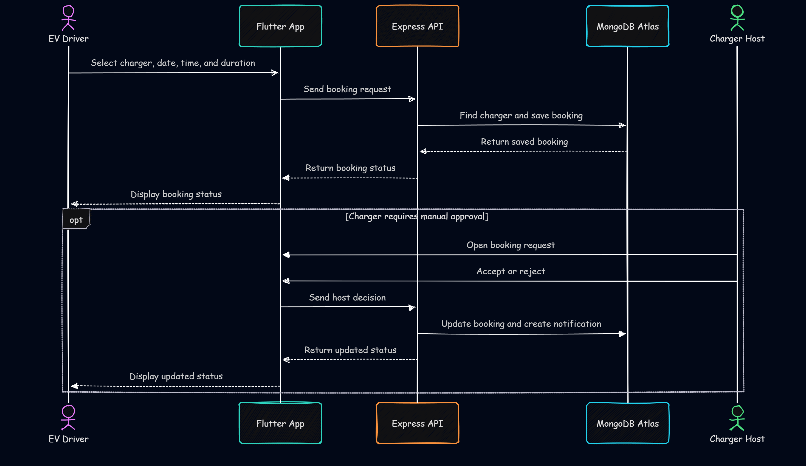

[comment]: # "This is the standard layout for the project, but you can clean this and use your own template, and add more information required for your own project"

<!-- Once you fill the index.json file inside /docs/data, please make sure the syntax is correct. (You can use this tool to identify syntax errors)

Please include the "correct" email address of your supervisors. (You can find them from https://people.ce.pdn.ac.lk/ )

Please include an appropriate cover page image ( cover_page.jpg ) and a thumbnail image ( thumbnail.jpg ) in the same folder as the index.json (i.e., /docs/data ). The cover page image must be cropped to 940×352 and the thumbnail image must be cropped to 640×360 . Use https://croppola.com/ for cropping and https://squoosh.app/ to reduce the file size.

If your followed all the given instructions correctly, your repository will be automatically added to the department's project web site (Update daily)

A HTML template integrated with the given GitHub repository templates, based on github.com/cepdnaclk/eYY-project-theme . If you like to remove this default theme and make your own web page, you can remove the file, docs/_config.yml and create the site using HTML. -->

# PowerShareSL
Peer-to-Peer EV Charging Platform

## Team
-  E/22/141, Dulanjaya Herath, [email](e22141.eng.pdn.ac.lk)
-  E/22/142, Pubudu Herath, [email](e22142.eng.pdn.ac.lk)
-  E/22/248, Akash Neelawathura, [email](e22248.eng.pdn.ac.lk)
-  E/22/362, Himasha Sathsarani, [email](e22362.eng.pdn.ac.lk)

<!-- Image (photo/drawing of the final hardware) should be here -->

<!-- This is a sample image, to show how to add images to your page. To learn more options, please refer [this](https://projects.ce.pdn.ac.lk/docs/faq/how-to-add-an-image/) -->

<!--  -->

#### Table of Contents
1. [Introduction](#introduction)
2. [Solution Architecture](#solution-architecture )
3. [Software Designs](#hardware-and-software-designs)
4. [Testing](#testing)
5. [Conclusion](#conclusion)
6. [Links](#links)

## Introduction

PowerShare SL is a peer-to-peer EV charging platform designed to connect electric vehicle (EV) drivers with people who provide private charging facilities.

The platform addresses the limited availability of public EV charging infrastructure by allowing EV drivers to discover nearby charging stations, check availability, book charging slots, and complete the payment process.

Charging hosts can register their charging stations, set charging details and prices, manage booking requests, and receive notifications. This creates a more accessible charging network while allowing existing private charging infrastructure to be utilized.

The system is developed as a mobile application using Flutter, with a Node.js and Express.js backend and MongoDB Atlas for cloud data storage. Google Maps is used for location-based charger discovery, while Google Sign-In and JWT are used for authentication..

## Solution Architecture

PowerShare SL follows a client-server architecture consisting of a Flutter mobile application, Node.js/Express backend, MongoDB Atlas database, and external services.

### Main Components

| Component | Role | Technology |
| --- | --- | --- |
| Mobile application | Driver and host interface | Flutter / Dart |
| Backend | API and business logic | Node.js / Express.js |
| Database | Stores users, chargers, and bookings | MongoDB Atlas |
| Authentication | Sign-in and protected API access | Google Sign-In / JWT |
| Maps | Charger location and discovery | OpenStreetMap / flutter_map |
| Notifications | In-app booking and status updates | Express API / MongoDB |
| Deployment | Backend hosting | Railway |

### Booking Flow

The diagram shows how a driver creates a booking and how a host responds when manual approval is required.

## Software Designs

1. Frontend Design
Flutter & Dart

The mobile application follows a component-based UI structure using Flutter. The application provides separate workflows for EV drivers and charger hosts.

EV Driver Interface

The driver can:

- Sign in with Google
- Select the EV Driver role
- View charging stations on an interactive map
- Search by name or address
- Filter chargers by speed and availability
- View charger details and prices
- Select date, time, and duration
- Make a booking
- Complete the mock payment flow
- Track bookings
- Receive notifications

2. Backend Design
Node.js & Express.js

The backend acts as the central communication layer between the mobile application and database.

It handles:

- REST API requests
- Authentication
- User management
- Charging station operations
- Booking operations
- Data validation
- Notifications
- Database communication

The backend is deployed using Railway, allowing the mobile application to communicate with the backend remotely.

3. Database Design
MongoDB Atlas

MongoDB Atlas is used as the cloud database for storing the system's data.

Main data can include:

- Users
- Charging stations
- Bookings
- Notifications
- Transactions

Database operations include Create, Read, Update, and Delete (CRUD) operations. The project also performs MongoDB CRUD and data persistence testing.

4. Authentication Design

PowerShare SL uses Google Sign-In for user authentication and JWT-based authentication for backend authorization.

The authentication flow can be represented as:

Google Sign-In → Authentication → JWT → Protected API Requests

The project initially used Firebase authentication but later migrated the backend authentication flow to Node.js with JWT.

## Testing

PowerShare SL uses several levels of testing.

Unit Testing

Individual components are tested separately, including:

- Flutter UI components
- API routes
- Schema validation
- Booking calculations
- Charger model validation
- JWT authentication middleware
- Integration Testing

The interaction between system components is tested through:

Flutter → Node.js API → MongoDB

Testing includes:

- End-to-end API flows
- MongoDB CRUD operations
- Data persistence
- Google Sign-In OAuth validation
- Complete booking lifecycle
- Acceptance Testing

The application is tested from the perspective of actual EV drivers and charger hosts.

Testing also considers:

- Low-network conditions
- Multiple Android devices
- Real user workflows

These testing approaches are documented in the final project presentation.

## Conclusion

PowerShare SL provides a peer-to-peer approach to EV charging by connecting EV drivers with private charging providers.

The platform combines location-based charger discovery, booking, host management, notifications, and payment functionality into a single mobile application.

The implemented MVP demonstrates the integration of a Flutter frontend, Node.js backend, MongoDB Atlas database, authentication, maps, and cloud deployment into a complete working system.

## Links

- [Project Repository](https://github.com/cepdnaclk/{{ page.repository-name }}){:target="_blank"}
- [Project Page](https://cepdnaclk.github.io/{{ page.repository-name}}){:target="_blank"}
- [Department of Computer Engineering](http://www.ce.pdn.ac.lk/)
- [University of Peradeniya](https://eng.pdn.ac.lk/)

[//]: # (Please refer this to learn more about Markdown syntax)
[//]: # (https://github.com/adam-p/markdown-here/wiki/Markdown-Cheatsheet)
